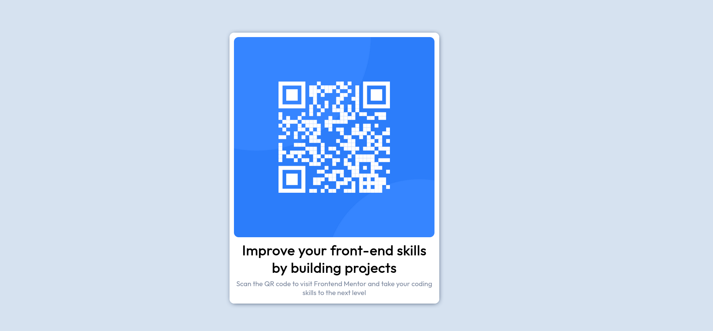

# Frontend Mentor - QR code component solution

This is a solution to the [QR code component challenge on Frontend Mentor](https://www.frontendmentor.io/challenges/qr-code-component-iux_sIO_H). Frontend Mentor challenges help you improve your coding skills by building realistic projects.

## Table of contents

- [Overview](#overview)
  - [Screenshot](#screenshot)
  - [Built with](#built-with)
  - [What I learned](#what-i-learned)
  - [Continued development](#continued-development)

## Overview

### Screenshot



### Built with

- Semantic HTML5 markup
- CSS custom properties
- Mobile-first workflow
- [Styled Components](https://fonts.google.com/knowledge) - For styles

### What I learned

I learnt how to use some basic and essential CSS properties when styling a selector and took note of the effects they render on the pages.

```html
<h1>Some HTML code I'm proud of</h1>
```

```css
main {
  margin: 0 auto;
}
* {
  margin: 0;
  padding: 0;
}
```

### Continued development

i'm currently working on centralizing a component vertically and the mother-child properties.
